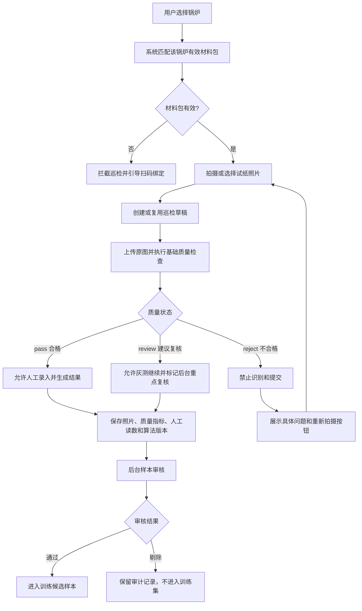

# 炉保保照片质量检查与不合格拦截逻辑

版本：V1.0  
更新日期：2026-07-27  
适用范围：小程序锅水六项试纸巡检、灰测人工录入、后续试纸智能识别

## 1. 目标与边界

照片质量检查用于判断图片是否具备留样、人工复核和后续智能识别的基础条件，不负责判断锅水指标，也不代表锅炉健康评分。

当前阶段检查文件、分辨率、压缩程度、亮度、对比度和清晰度。试纸是否完整、是否包含标准色卡、显色时间是否正确、拍摄角度和反光区域定位，需在后续视觉模型中补充。

本文件中的数值是炉保保灰测工程阈值，不是国家标准限值。正式智能识别上线前，必须结合真实手机、试纸品牌、材料包批次和现场环境重新标定。

## 2. 完整业务流程



## 3. 拍摄前要求

1. 试纸反应区和配套色卡完整进入画面。
2. 使用均匀白光，避免彩色灯光和闪光灯直射。
3. 清洁镜头，避开蒸汽、水雾、阴影和镜面反光。
4. 手机与试纸尽量平行，对焦在试纸色块和色卡刻度。
5. 按试纸说明书规定的显色时间拍摄。
6. 尽量上传相机原图，不使用聊天软件转发后压缩的图片。

## 4. 基础质量判定规则

| 检查项 | 合格 `pass` | 建议复核 `review` | 不合格 `reject` |
|---|---:|---:|---:|
| 文件格式 | JPG、PNG、WebP | 无 | 其他格式或无法解码 |
| 文件体积 | 30KB-12MB | 15KB-30KB | 空文件、小于15KB或大于12MB |
| 图片短边 | 不低于720像素 | 无 | 低于720像素 |
| 平均亮度 | 45-220 | 25-45或220-235 | 低于25或高于235 |
| 灰度对比度 | 不低于18 | 10-18 | 低于10 |
| 边缘清晰度 | 不低于80 | 35-80 | 低于35 |

边界采用前闭后开方式理解。例如亮度等于45视为合格，亮度等于25视为建议复核。

同一照片可能同时命中多个问题。只要存在一个 `reject` 问题，整张照片即为不合格。

## 5. 状态与处置

### 5.1 `pass` 合格

- 未命中任何质量问题。
- 允许继续人工录入和生成检测结果。
- 后台仍保留原图和质量指标，不能因为基础检查通过就直接作为训练真值。

### 5.2 `review` 建议复核

- 只命中轻度质量问题。
- 灰测阶段允许继续人工录入，避免现场流程因保守阈值中断。
- 样本默认保持 `pending`，后台样本审核页应重点复核。
- 后续智能识别正式上线时，可根据模型验证结果改为限制自动读数，只允许人工确认。

### 5.3 `reject` 不合格

- 命中至少一个严重质量问题。
- 后端保存照片、质量指标和拒绝原因，作为质量统计和审计资料。
- 小程序禁止进入识别与结果生成，展示首要原因及全部问题。
- 用户必须重新拍摄；重新上传复用原巡检草稿，不重复创建无效巡检。
- 新照片覆盖该草稿的当前样本信息，同时保留服务器日志和必要审计记录。

## 6. 质量评分

质量评分从100分开始：

- 每个 `review` 问题扣15分。
- 每个 `reject` 问题扣40分。
- 最低为0分。

质量状态由问题严重程度决定，不以总分直接决定。因此即使总分较高，只要存在一个严重问题，仍必须重拍。

质量评分只用于界面提示、后台排序和灰测统计，不得替代单项问题判断。

## 7. 后端返回字段

上传接口返回：

```json
{
  "qualityStatus": "review",
  "qualityScore": 85,
  "qualitySummary": "照片存在轻度质量问题，可继续灰测，后台需重点复核",
  "canProceed": true,
  "nextAction": "manual_review",
  "width": 1680,
  "height": 1050,
  "brightness": 242.2,
  "contrast": 31.4,
  "sharpness": 96.8,
  "qualityFlags": [
    {
      "code": "too_bright",
      "severity": "review",
      "message": "画面过亮或存在强反光"
    }
  ]
}
```

`nextAction` 取值：

- `continue`：继续巡检。
- `manual_review`：允许继续灰测，后台人工复核。
- `retake`：必须重新拍摄。

识别接口会再次读取服务器保存的质量状态。即使客户端绕过页面按钮，只要状态为 `reject`，后端仍拒绝识别。

## 8. 小程序交互规则

1. 用户选择照片后，旧质量结果立即清空。
2. 用户点击“检查照片质量”，系统创建或复用巡检草稿并上传原图。
3. 合格用绿色状态展示；建议复核用黄色；不合格用红色。
4. 页面显示质量分、图片尺寸、亮度、对比度、清晰度和逐项问题。
5. 不合格时主提交按钮显示“请先重新拍摄”，并提供醒目的“重新拍摄”按钮。
6. 用户未主动检查就点击“开始巡检”时，系统先自动执行质量检查。
7. 重拍后复用同一个巡检草稿，再次上传并覆盖当前样本质量结果。
8. 切换锅炉、材料包或退出复测时，清空草稿和照片状态，防止照片串到其他锅炉。

## 9. 数据留存

每次有效上传至少保存：

- 巡检ID、企业ID、锅炉ID、材料包ID和巡检人。
- 原始图片地址、格式、尺寸和文件体积。
- 亮度、对比度、清晰度、质量分、质量状态和问题列表。
- 人工录入值、未来AI值、后台确认值和算法版本。
- 样本审核状态、审核人、审核时间和审核说明。

人工值、AI值和后台确认值必须分字段保存，禁止互相覆盖。

## 10. 灰测验收用例

| 用例 | 预期结果 |
|---|---|
| 正常手机原图 | `pass`，允许继续 |
| 轻微偏暗或轻微模糊 | `review`，允许灰测，后台待复核 |
| 短边低于720像素 | `reject`，强制重拍 |
| 全黑或严重过暗图片 | `reject`，提示增加照明 |
| 全白或严重反光图片 | `reject`，提示关闭直射闪光 |
| 严重模糊图片 | `reject`，提示稳定手机并重新对焦 |
| 不支持的格式或损坏文件 | 上传失败，不创建可识别样本 |
| 不合格后重拍合格照片 | 复用原巡检草稿，状态更新为 `pass` |
| 客户端绕过按钮直接识别 | 后端根据 `reject` 状态再次拦截 |

## 11. 后续升级

进入智能识别阶段后，建议依次增加：

1. 试纸、标准色卡和参考白区完整性检测。
2. 反光、水雾、阴影和遮挡区域检测。
3. 拍摄角度、透视畸变和旋转角度检测。
4. 显色计时和试纸批次校验。
5. 基于真实样本重新标定不同手机和现场环境阈值。
6. 将基础质量分与模型识别置信度分开保存和展示。
